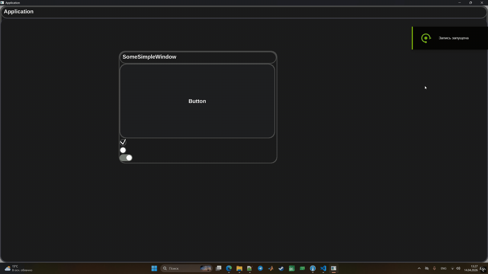

# Contents

- [Description](#description)

- [Getting started](#getting-started)
    - [Requirements](#requirements)
    - [How it works](#how-it-works)
    - [Configring IDE to use CMake](#configring-ide-to-use-cmake)
    - [Setup CMake project](#setup-cmake-project)
    - [Launching application loop](#launching-application-loop)
    - [Coding a simple GUI](#coding-a-simple-gui)
- [Alternatives](#alternatives)

## **Description**

Frenchie is **C++ micro framework for development applications with graphical user interface (GUI)**. The main aim of the project is to provide lightweight, simple and straightforward capabilities for **cross-platform GUI applications development in modern C++**.

## **Getting started**

### **Requirements**

Frenchie is C++/CMake library. To start using it you need C++17 or higher compatible compiler and CMake 3.3 or newer.

### **How it works**

Frenchie is layered appication loop that executes range of layer processing functions untill the application is closed. Every application layer is responsible for a limited scope of functions. To drive context window and graphics Frenchie uses platform and rendering backends.

Platform backend abstracts system specific functions for context window creation, manipulation and events catching.Graphics backend abstracts graphics processing unit (GPU) rendering API and is in charge of loading stuff on GPU for rendering.

Thus, to start using Frenchie as a driver for GUI in your application you need:

1 Configure your IDE to use CMake

2 Integrate Frenchie into your project as CMake subdirectory

3 Setup platform and rendering backends you want to use

4 Push GUI rendering layer into application loop

5 Launch application loop

### **Configring IDE to use CMake**

As Frenchie is built using CMake you need to configure your IDE to use CMake as a build system. Visit the following link to know how to configure your IDE to use CMake: https://cmake.org/cmake/help/latest/guide/ide-integration/index.html

### **Setup CMake project**

Before configuring Frenchie micro framework you need to setup common CMake and C/C++ options:

``` CMake
#--------------------------------------------------------------
# setup CMake
#--------------------------------------------------------------
cmake_minimum_required(VERSION ${CMAKE_VERSION})
project(FrenchieGUIGettingStartedProject VERSION 1.0.0 LANGUAGES C CXX)

#--------------------------------------------------------------
# setup common project options
#--------------------------------------------------------------
set(CMAKE_WINDOWS_EXPORT_ALL_SYMBOLS ON)
set(CMAKE_CXX_STANDARD 17)
set(CMAKE_CXX_STANDARD_REQUIRED ON)
if(CMAKE_VERSION VERSION_LESS "3.7.0")
    set(CMAKE_INCLUDE_CURRENT_DIR ON)
endif()
```
Frenchie is C++17 library, so to start using it, you need C++17 compatible compiler and CMake 3.3 or newer. As far, as CMake and C++ options are set, you need to configure Frenchie. As it was mentioned in previous section Frenchie uses platform and rendering backends for system specific and graphics API's abstraction.

To setup platform backend you need to specify **FRENCHIE_PLATFORM_BACKEND** string variable value. The following table shows which libraries can be used as platform backends and the values you need to setup for **FRENCHIE_PLATFORM_BACKEND** to start using them:

| Backend  |FRENCHIE_PLATFORM_BACKEND |
| -------- |--------------------------|
| SDL3     |SDL                       |
| GLFW     |GLFW                      |

Frenchie uses CMake FetchContent module to download and configure supported platform backend libraries. By default GLFW and SDL3 libraries are cloned from my own forks of appropriate repos. If you want to use GLFW and SDL3 from some other repos you are welcome to change appropriate **FRENCHIE_PLATFORM_BACKEND_GLFW_GIT_REPO_LINK** and **FRENCHIE_PLATFORM_BACKEND_SDL3_GIT_REPO_LINK** string variables values in your CMake project. You can also configure which branches to use using **FRENCHIE_PLATFORM_BACKEND_GLFW_GIT_REPO_BRANCH** and **FRENCHIE_PLATFORM_BACKEND_SDL3_GIT_REPO_BRANCH** string variables

To setup rendering backend you need to specify **FRENCHIE_GRAPHICS_BACKEND** string variable value. The following table shows which graphics API can be used as rendering backends and the values you need to setup for **FRENCHIE_GRAPHICS_BACKEND** to start using them.

| Backend  |FRENCHIE_GRAPHICS_BACKEND |
| -------- |--------------------------|
| OpenGL3  |OPENGL                    |

Besides, you may want to specify how to build Frenchie either as static or shared library. This is specified by **FRENCHIE_BUILD_STATIC_LIBRARY** boolean variable. The following CMake code snippet shows how to configure Frenchie to use SDL3 library as platform backend and OpenGL graphics API as rendering backend:

``` CMake
#--------------------------------------------------------------
# setup Frenchie library
#--------------------------------------------------------------
set(FRENCHIE_BUILD_STATIC_LIBRARY ON       CACHE BOOL   "Set libary type" FORCE)
set(FRENCHIE_PLATFORM_BACKEND     "SDL"    CACHE STRING "Set platform backend" FORCE)
set(FRENCHIE_GRAPHICS_BACKEND     "OPENGL" CACHE STRING "Set rendering backend" FORCE)
add_subdirectory("${CMAKE_SOURCE_DIR}/../../frenchie/" frenchie_build)
```
After common project options and Frenchie options are set we need to collect project source code files and use them to build and application executable. Frenchie provides handy CMake macro - **collect_source_code_and_resources.cmake** for this purpose. The macro can collect C/C++ source code files from a given lists of directories and/or source code files. The following CMake code snippet shows how to use **collect_source_code_and_resources.cmake** macro to collect source code from a given directory and use the collected files to force CMake to build an application executable:

``` CMake
#--------------------------------------------------------------
# add executable
#--------------------------------------------------------------
# this is a really handy macro that collects
# source code within predefined list of directories
include("${CMAKE_SOURCE_DIR}/../../frenchie/cmake/collect_source_code_and_resources.cmake")

list(APPEND KERNEL "source/")

set(PATHS "")
list(APPEND PATHS ${KERNEL} ${TOOLS})
cmake_language(CALL COLLECT_SOURCE_CODE_AND_RESOURCES PATHS)
add_executable(${PROJECT_NAME} ${HEADERS} ${SOURCES})
target_include_directories(${PROJECT_NAME} PUBLIC ${DIRECTORIES})
target_link_libraries(${PROJECT_NAME} PRIVATE Frenchie)
```

The whole CMakeLists.txt file that configures Frenchie and forces CMake to build an executable of your project is shown bellow:

``` CMake
#--------------------------------------------------------------
# setup CMake
#--------------------------------------------------------------
cmake_minimum_required(VERSION ${CMAKE_VERSION})
project(FrenchieGUIGettingStartedProject VERSION 1.0.0 LANGUAGES C CXX)

#--------------------------------------------------------------
# setup common project options
#--------------------------------------------------------------
set(CMAKE_WINDOWS_EXPORT_ALL_SYMBOLS ON)
set(CMAKE_CXX_STANDARD 17)
set(CMAKE_CXX_STANDARD_REQUIRED ON)
if(CMAKE_VERSION VERSION_LESS "3.7.0")
    set(CMAKE_INCLUDE_CURRENT_DIR ON)
endif()

#--------------------------------------------------------------
# setup Frenchie library
#--------------------------------------------------------------
set(FRENCHIE_BUILD_STATIC_LIBRARY ON       CACHE BOOL   "Set libary type" FORCE)
set(FRENCHIE_PLATFORM_BACKEND     "SDL"    CACHE STRING "Set platform backend" FORCE)
set(FRENCHIE_GRAPHICS_BACKEND     "OPENGL" CACHE STRING "Set rendering backend" FORCE)
add_subdirectory("${CMAKE_SOURCE_DIR}/../../frenchie/" frenchie_build)

#--------------------------------------------------------------
# add executable
#--------------------------------------------------------------
# this is a really handy macro that collects
# source code within predefined list of directories
include("${CMAKE_SOURCE_DIR}/../../frenchie/cmake/collect_source_code_and_resources.cmake")

list(APPEND KERNEL "source/")

set(PATHS "")
list(APPEND PATHS ${KERNEL} ${TOOLS})
cmake_language(CALL COLLECT_SOURCE_CODE_AND_RESOURCES PATHS)
add_executable(${PROJECT_NAME} ${HEADERS} ${SOURCES})
target_include_directories(${PROJECT_NAME} PUBLIC ${DIRECTORIES})
target_link_libraries(${PROJECT_NAME} PRIVATE Frenchie)
```

The example project using the above CMakeLists.txt is located in **examples/FrenchieGUIExampleProject** folder. See this folder contents to dive into further details of CMake Frenchie project configuration.

### **Launching application loop**

Frenchie is layered application loop that uses platform and rendering backends for context window creation and for rendering graphics within it. So, to launch context window, it's enough to do what is presented within the following C++ code snippet:

``` C++
#include <FrenchieApplication.hpp>

int main(int argc, char *argv[])
{
    (void)argc;
    (void)argv;
    return Frenchie::Application::application()->execute();
}
```
The code above opens default context window.

### **Coding a simple GUI**

To start coding GUI, you can create separate layer that pushes GUI management layer within application loop and provides a client code of your GUI. It's recommended to create a separate layer for each application window. The following code snippet shows how to create layer for window displaying a simple color pciker:

``` C++
#include <FrenchieApplication.hpp>
#include <FrenchieImmediateUserInterfaceLayer.hpp>

class SomeSimpleGuiLayer : public Frenchie::Application::Layer
{
public:
    SomeSimpleGuiLayer() : Frenchie::Application::Layer("TestLayer"){}
    virtual ~SomeSimpleGuiLayer(){}

    virtual bool awake() override
    {
        if(m_UI == nullptr)
            m_UI = Frenchie::Application::application()->push_layer<Frenchie::Application::ImmediateUserInterfaceContextLayer>();

        return m_UI != nullptr;
    }

    virtual void frame_update() override
    {
        if(m_UI->begin_window(m_UI->next_id("SomeSimpleWindow")))
        {
            m_UI->next_content_margin(gs_vec4f(
                m_UI->m_Style.get_frames_width() + m_UI->m_Style.get_frames_radius() * 0.5f, // top
                m_UI->m_Style.get_frames_width() + m_UI->m_Style.get_frames_radius() * 0.5f, // left
                0.f,  // right
                0.f   // bottom 
            ));

            m_UI->next_content_padding(gs_vec4f(
                m_UI->m_Style.get_frames_width() + m_UI->m_Style.get_frames_radius() * 0.5f, // top
                m_UI->m_Style.get_frames_width() + m_UI->m_Style.get_frames_radius() * 0.5f, // left
                0.f,  // right
                0.f   // bottom 
            ));

            if(m_UI->begin_vertical_stack(
                m_UI->next_id("ColorEditor"),
                Frenchie::Application::ImmediateUserInterfaceNodeSettings_::ImmediateUserInterfaceNodeSettings_VerticalContentAlignmentCenter
                | Frenchie::Application::ImmediateUserInterfaceNodeSettings_::ImmediateUserInterfaceNodeSettings_HorizontalContentAlignmentCenter))
            {
                m_UI->next_maximum_size(gs_vec2f(gs_huge<float>(), m_UI->m_Style.get_font_size()));

                if(m_UI->begin_horizontal_stack(m_UI->next_id("Combobox")))
                {
                    m_UI->label(m_UI->next_id("ColorPickerType"), "Type");

                    if(m_UI->begin_combobox(m_UI->next_id("Combobox"),m_RGBAColorPicker ? "RGBA" : "HSVA"))
                    {
                        bool rgbaSelected     = m_RGBAColorPicker;
                        bool hsvaSelected     = !m_RGBAColorPicker;
                        int  checkboxSettings = Frenchie::Application::ImmediateUserInterfaceCheckButtonSettings_::ImmediateUserInterfaceCheckButtonSettings_Checkbox;

                        m_UI->check_button(m_UI->next_id("RGBASelected"), rgbaSelected, checkboxSettings);
                        m_UI->same_line();
                        if(m_UI->combobox_item(m_UI->next_id("RGBA", "RGBA"))) m_RGBAColorPicker = true;

                        m_UI->check_button(m_UI->next_id("HSVASelected"), hsvaSelected, checkboxSettings);
                        m_UI->same_line();
                        if(m_UI->combobox_item(m_UI->next_id("HSVA", "HSVA"))) m_RGBAColorPicker = false;

                        m_UI->end_combobox();
                    }

                    m_UI->end_horizontal_stack();
                }

                if(m_UI->begin_horizontal_stack(m_UI->next_id("Pickers")))
                {
                    if(m_RGBAColorPicker)
                        m_UI->color_picker_rgba(m_UI->next_id("RGBAColorPicker"), m_ColorPickerColor);
                    else
                        m_UI->color_picker_hsva( m_UI->next_id("HSVAColorPicker"), m_ColorPickerColor);

                    m_UI->end_horizontal_stack();
                }

                m_UI->end_vertical_stack();
            }

            m_UI->end_window();
        }
    }

    std::shared_ptr<Frenchie::Application::ImmediateUserInterfaceContextLayer> m_UI{nullptr};

    gs_color m_ColorPickerColor = gs_color_rgba(255, 0, 0, 255); // white
    bool     m_RGBAColorPicker  = true;                          // use RGBA color picker

};

int main(int argc, char *argv[])
{
    (void)argc;
    (void)argv;

    Frenchie::Application::application()->push_layer<SomeSimpleGuiLayer>();
    return Frenchie::Application::application()->execute();
}
```

The code above creates the following simple window displaying some buttons:



For more examples refer to **examples/** folder.

## **Alternatives**

This project has been inspired by Dear ImGUI (https://github.com/ocornut/imgui) and Nuklear (https://github.com/vurtun/nuklear) libraries, so Frenchie GUI module is implemented in immediate mode paradigm. Anyway, there are other alternatives providing more functionality:

| Name      | Purpose                                                                 | link                                         |
| ----------|-------------------------------------------------------------------------| ---------------------------------------------|
| ImGUI     | Tools and data driven GUI applications development                      | https://github.com/ocornut/imgui             |
| Nuklear   | Tools and data driven GUI applications development                      | https://github.com/Immediate-Mode-UI/Nuklear |
| Qt        | Cross-platform application development framework                        | https://www.qt.io/                           |
| WxWidgets | Cross-platform application development framework                        | https://wxwidgets.org/                       |