[English](README.md) | [Russian](README.ru.md)

[](http://opensource.org/licenses/MIT)
[](https://alexey-cpu.github.io/Frenchie/)

Frenchie
=====

<p align="center">Компактный C++ framewok для разработки приложений с графическим интерфейсом пользователя.</p>

---

<p align="center"></p>


- [Общие сведения](#общие-сведения)
- [Возможности](#возможности)
- [Начало работы](#начало-работы)
    - [Требования к набору инструментов](#требования-к-набору-инструментов)
    - [Как это работает](#как-это-работает)
    - [Пример создания простого проекта](#пример-создания-простого-проекта)
- [Другие похожие проекты](#другие-похожие-проекты)

## **Общие сведения**

Frenchie - **это компактный C++ framework для разработки приложений с графическим интерфейсом пользователя**. Основная цель проекта - создать простой в использовании инструмент, позволяющий легко и быстро создавать приложения с графическим интерфейсом пользователя на языке C++ для множества платформ.

## **Возможности**

### *Пользовательский интерфейс*

Библиотека предоставляет простой и мощный модуль рисования элементов графического интерфейсы.

#### *Окна*

Окна являются основным элементом графического интерфейса. Окна поддерживают механику прикрепления/открепления и умеют сохранять свое состояние в *.ini* файл для восстановления состояния при повторном запуске приложения:

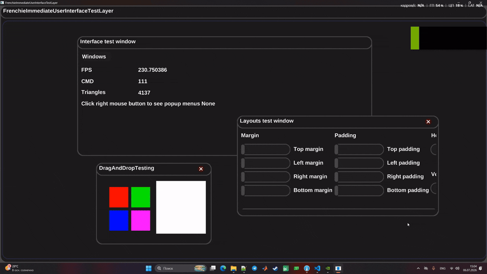

#### *Диалоговые окна*

Модуль рисования элементов графического интерфейса поддерживает создание модальных вложенных диалоговых окон:

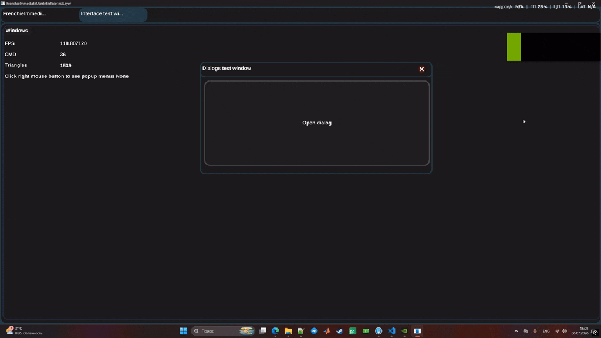

#### *Оконные меню, всплывающие контекстные меню*

Модуль рисования элементов графического интерфейса поддерживает создание встроенных в окна и всплывающих контекстных меню:

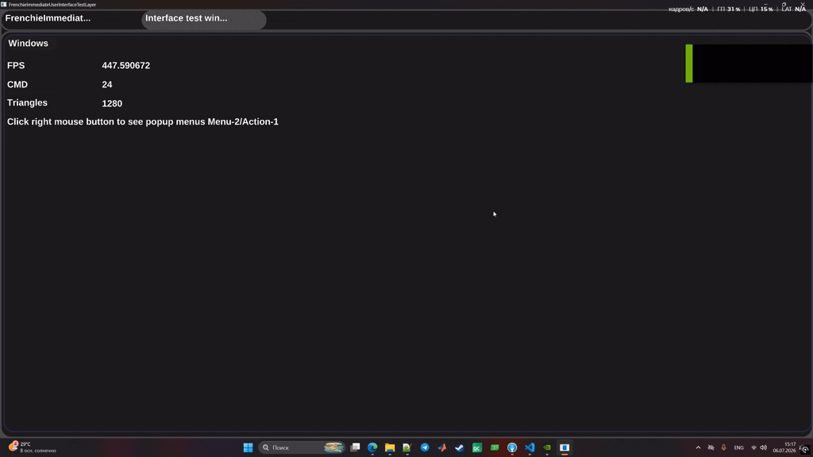

#### *Виджеты*

Модуль рисования элементов графического интерфейса поддерживает большое количество виджетов, ниже приведены примеры некоторых из них.

Кнопки, чекбоксы и радио-кнопки:

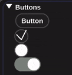

Прогресс бары:

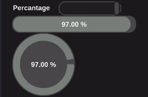

Регуляторы цвета:

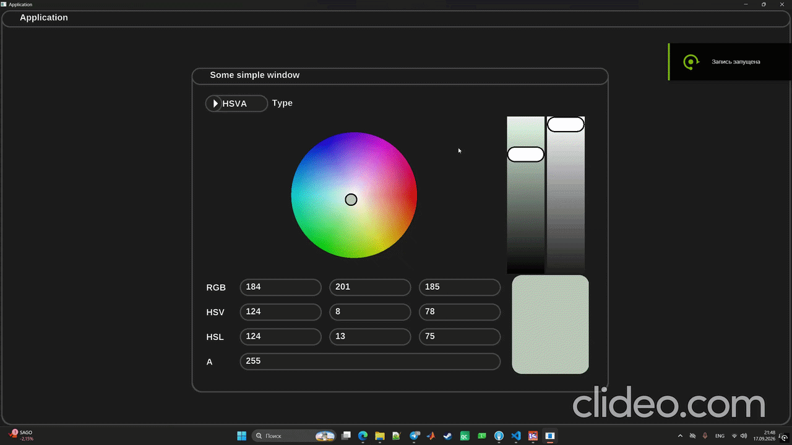

Скалярный ввод:

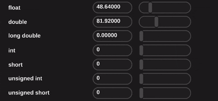

Текстовый ввод:

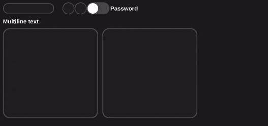

2D графики с различными режимами работы:

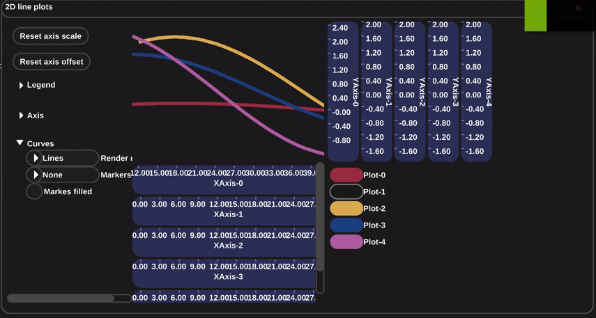

Круговые и векторные диаграммы:

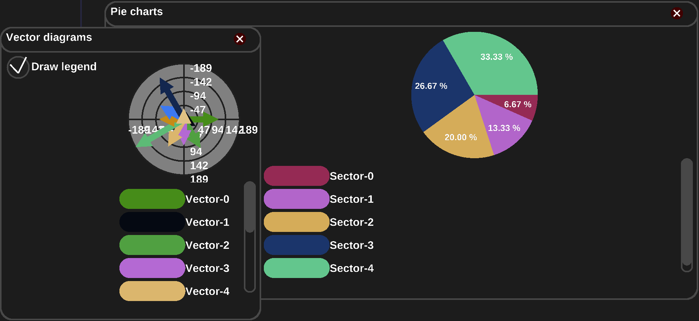

Таблицы:

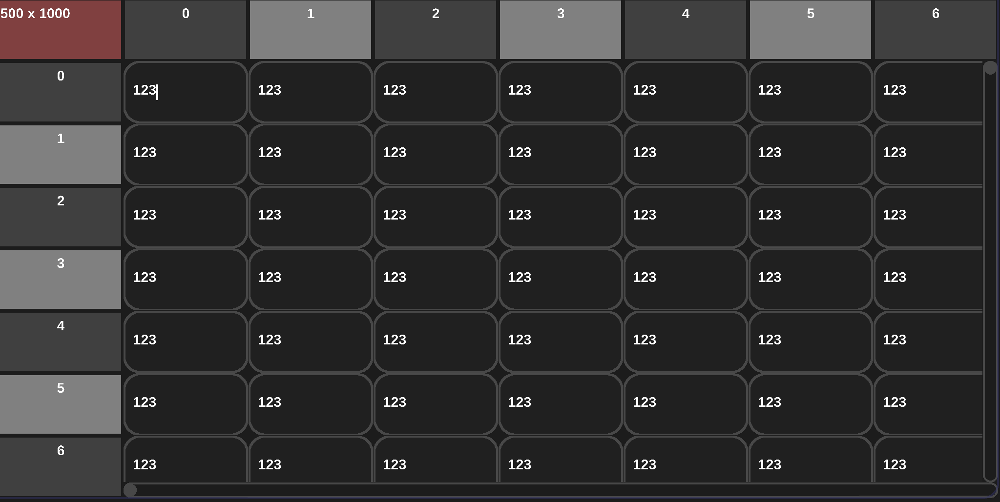

Деревья:

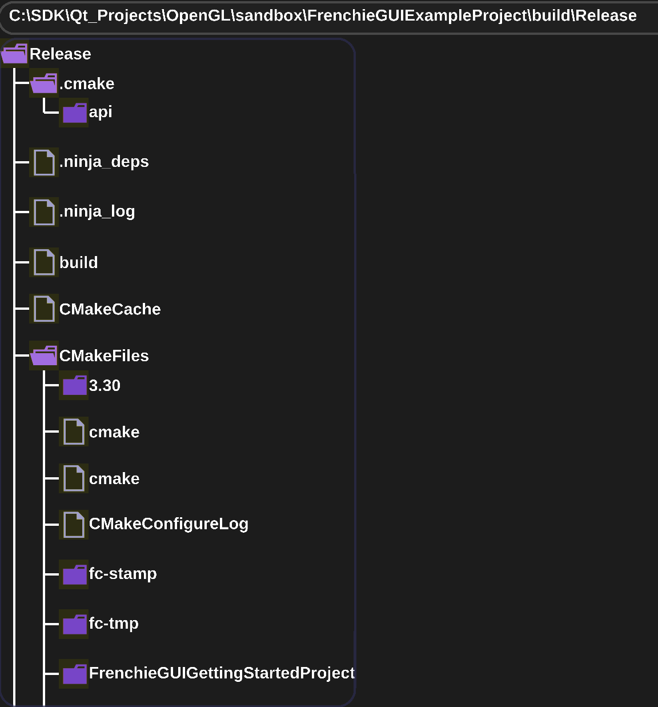

Drag&drop и пользовательский рендеринг:

Модуль рендеринга Frenchie используется в модуле рисования элементов графического интерфейса и может использоваться отдельно для рисования в контекстном окне, либо внутри модуля графического интерфейса через специальный виджет - 2D canvas:

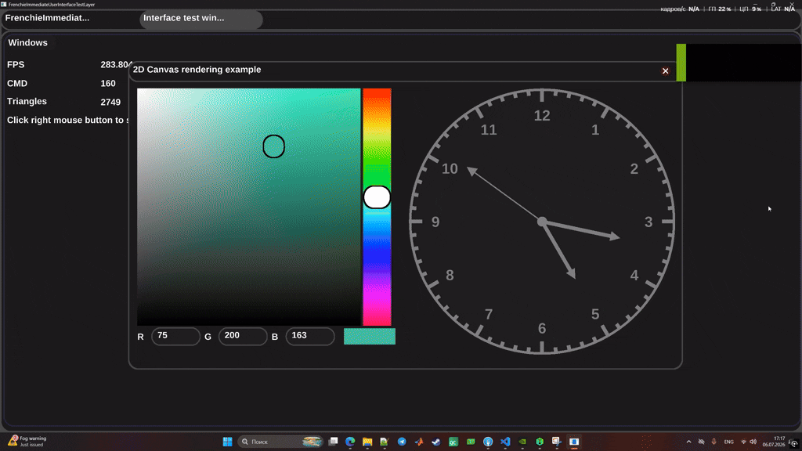

Layouts:

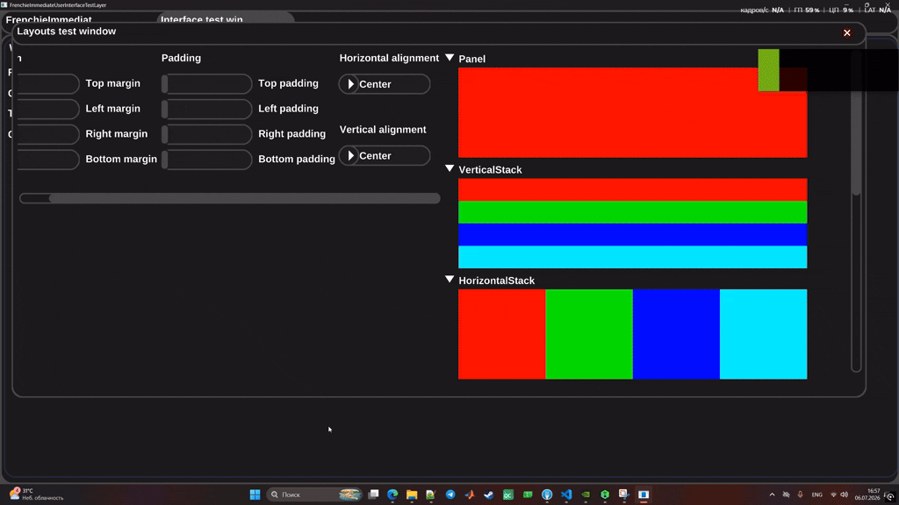

For many more examples see **examples/** folder.

## **Начало работы**

### **Требования к набору инструментов**

**Frenchie** является C++ библиотекой, использующей систему сборки CMake. Для того, чтобы начать работать с **Frenchie**, нужно установить компилятор с поддержкой C++ 17 и выше, а также CMake 3.3 или новее.

### **Как это работает**

**Frenchie** - это бесконечный цикл, обрабатывающий список слоев приложения до тех пор, пока оно не закроется. Каждый слой реализует ограниченный набор функций. Для запуска контекстного окна и рисования графики **Frenchie** использует системный и графический backend-ы. Системный backend оборачивает платформо-зависимый функционал операционной системы, предназначенный для открытия окна и отслеживания связанных с ним событий. Графический backend оборачивает платформо-зависимый функционал, отвечающий за загрузку геометрии и текстур на видеокарту для последующей рисовки.

### **Пример создания простого проекта**

При создании **CMake** проекта рекомендуется использовать модуль **CMake FetchContent** для скачивания и конфигурирования актуальной версии **Frenchie**. Также в проекте рекомендуется использовать такую структуру папок:

```
Project/
|-- source
|--|--main.cpp
|--tools
|--|--frenchie.cmake
└── CMakeLists.txt
```
В папке **source/** должны располагатся файлы с исходным кодом проекта, а в папке **tools/** - **.cmake** файлы, предназначенные для скачивания и конфигурирования зависимостей проекта с использованием модуля **CMake FetchContent**. В данном примере всего одна зависимость - **Frenchie** и файл **frenchie.cmake** должен выглядеть так:

``` CMake
include(FetchContent)

# load Frenchie from remote
FetchContent_Declare(
    Frenchie
    GIT_REPOSITORY "https://github.com/Alexey-cpu/Frenchie.git"
    GIT_TAG "origin/v1/release"
    OVERRIDE_FIND_PACKAGE
	GIT_SHALLOW TRUE)

# configure Frenchie
set(FRENCHIE_BUILD_STATIC_LIBRARY ON        CACHE BOOL   "Set libary type" FORCE)
set(FRENCHIE_PLATFORM_BACKEND     "SDL3"    CACHE STRING "Set platform backend" FORCE)
set(FRENCHIE_GRAPHICS_BACKEND     "OPENGL3" CACHE STRING "Set rendering backend" FORCE)

FetchContent_MakeAvailable(Frenchie)
```

Файл выше конфигурирует **Frenchie** как статическую библиотеку, использующую **SDL3** как системный backend, а **OPENGL3** - как графический backend.

На данный момент, **Frenchie** использует сторонние библиотеки в качестве системного backend-а. Ниже представлен список сторонних библиотек, работа с которыми поддержана во **Frenchie**:

| Backend  |FRENCHIE_PLATFORM_BACKEND |
| -------- |--------------------------|
| SDL3     |SDL3                      |
| GLFW     |GLFW                      |

Графический backend **Frenchie** - это, по сути, обертка над графическими API, типа DirectX, OpenGL и.т.д. Ниже приведен список графических API, работа с которыми поддержана в данной версии **Frenchie**:

| Backend     |FRENCHIE_GRAPHICS_BACKEND |
| ------------|--------------------------|
| OpenGL3     |OPENGL3                   |
| DirectX9    |DIRECTX9                  |
| MacOS Metal |METAL                     |

Сконфигурировав **Frenchie**, можно приступать к написанию **CMakeLists.txt** файла проекта:

``` CMake
#--------------------------------------------------------------
# setup CMake
#--------------------------------------------------------------
cmake_minimum_required(VERSION ${CMAKE_VERSION})
project(FrenchieGUIGettingStartedProject VERSION 1.0.0 LANGUAGES C CXX)

#--------------------------------------------------------------
# setup common project options
#--------------------------------------------------------------
set(CMAKE_WINDOWS_EXPORT_ALL_SYMBOLS ON)
set(CMAKE_CXX_STANDARD 17)
set(CMAKE_CXX_STANDARD_REQUIRED ON)
if(CMAKE_VERSION VERSION_LESS "3.7.0")
    set(CMAKE_INCLUDE_CURRENT_DIR ON)
endif()

#--------------------------------------------------------------
# setup Frenchie library
#--------------------------------------------------------------
include("${CMAKE_CURRENT_LIST_DIR}/tools/frenchie.cmake")
add_subdirectory("${frenchie_SOURCE_DIR}/frenchie/")

#--------------------------------------------------------------
# add executable
#--------------------------------------------------------------
# this is a really handy macro that collects source code within predefined list of directories
include("${frenchie_SOURCE_DIR}/frenchie/cmake/collect_source_code_and_resources.cmake")

list(APPEND KERNEL "source/")

set(PATHS "")
list(APPEND PATHS ${KERNEL} ${TOOLS})
cmake_language(CALL COLLECT_SOURCE_CODE_AND_RESOURCES PATHS)
add_executable(${PROJECT_NAME} ${HEADERS} ${SOURCES})
target_include_directories(${PROJECT_NAME} PUBLIC ${DIRECTORIES})
target_link_libraries(${PROJECT_NAME} PUBLIC Frenchie)
```

Файл выше конфигурирует **C++17 CMake** проект, который реализует сборку исполняемого файла приложения с грфическим интерфейсом пользователя. При создании исполняемого файла требуется знать список файлов с исходным кодом проекта, а также список включаемых в проект директорий. Оба указанных списка можно сгенерировать при помощи **CMake** макроса - *collect_source_code_and_resources.cmake**. Данный макрос умеет собирать в список как одиночные C/C++ и Objective-C/C++ файлы, так и доставать их рекурсивно из папок проекта.

Чтобы начать разрабатывать приложение, требуется создать слой, который будет добавлять слой UI в цикл приложения **Frenchie**. Рекомендуется для каждого отдельного окна приложения создавать отдельный слой. Ниже представлен код, который создает простое окно с редактором цвета:

``` C++
#include <FrenchieApplication.hpp>
#include <FrenchieImmediateUserInterfaceLayer.hpp>

class SomeSimpleGuiLayer : public Frenchie::Application::Layer
{
public:
    SomeSimpleGuiLayer() : Frenchie::Application::Layer("TestLayer"){}
    virtual ~SomeSimpleGuiLayer(){}

    virtual bool awake() override
    {
        if(m_UI == nullptr)
            m_UI = Frenchie::Application::application()->push_layer<Frenchie::Application::ImmediateUserInterfaceContextLayer>();

        return m_UI != nullptr;
    }

    virtual void frame_update() override
    {
        if(m_UI->begin_window(m_UI->next_id("SomeSimpleWindow")))
        {
            m_UI->next_content_margin(gs_vec4f(
                m_UI->m_Style.get_frames_width() + m_UI->m_Style.get_frames_radius() * 0.5f, // top
                m_UI->m_Style.get_frames_width() + m_UI->m_Style.get_frames_radius() * 0.5f, // left
                0.f,  // right
                0.f   // bottom 
            ));

            m_UI->next_content_padding(gs_vec4f(
                m_UI->m_Style.get_frames_width() + m_UI->m_Style.get_frames_radius() * 0.5f, // top
                m_UI->m_Style.get_frames_width() + m_UI->m_Style.get_frames_radius() * 0.5f, // left
                0.f,  // right
                0.f   // bottom 
            ));

            if(m_UI->begin_vertical_stack(
                m_UI->next_id("ColorEditor"),
                Frenchie::Application::ImmediateUserInterfaceNodeSettings_::ImmediateUserInterfaceNodeSettings_VerticalContentAlignmentCenter
                | Frenchie::Application::ImmediateUserInterfaceNodeSettings_::ImmediateUserInterfaceNodeSettings_HorizontalContentAlignmentCenter))
            {
                m_UI->next_height(m_UI->get_text_line_height());

                if(m_UI->begin_horizontal_stack(m_UI->next_id("Combobox")))
                {
                    auto parentBox = m_UI->current_bounding_box(m_UI->get_rendering_stack_top()).size();

                    m_UI->label(m_UI->next_id("ColorPickerType"), "Type");

                    m_UI->next_size(512.f);

                    if(m_UI->begin_combobox(m_UI->next_id("Combobox"),m_RGBAColorPicker ? "RGBA" : "HSVA"))
                    {
                        bool rgbaSelected     = m_RGBAColorPicker;
                        bool hsvaSelected     = !m_RGBAColorPicker;
                        int  checkboxSettings = Frenchie::Application::ImmediateUserInterfaceCheckButtonSettings_::ImmediateUserInterfaceCheckButtonSettings_Checkbox;

                        m_UI->check_button(m_UI->next_id("RGBASelected"), rgbaSelected, checkboxSettings);
                        m_UI->same_line();
                        if(m_UI->combobox_item(m_UI->next_id("RGBA", "RGBA"))) m_RGBAColorPicker = true;

                        m_UI->check_button(m_UI->next_id("HSVASelected"), hsvaSelected, checkboxSettings);
                        m_UI->same_line();
                        if(m_UI->combobox_item(m_UI->next_id("HSVA", "HSVA"))) m_RGBAColorPicker = false;

                        m_UI->end_combobox();
                    }

                    m_UI->end_horizontal_stack();
                }

                if(m_RGBAColorPicker)
                    m_UI->color_picker_rgba(m_UI->next_id("RGBAColorPicker"), m_ColorPickerColor);
                else
                    m_UI->color_picker_hsva( m_UI->next_id("HSVAColorPicker"), m_ColorPickerColor);

                m_UI->end_vertical_stack();
            }

            m_UI->end_window();
        }
    }

    std::shared_ptr<Frenchie::Application::ImmediateUserInterfaceContextLayer> m_UI{nullptr};

    gs_color m_ColorPickerColor = gs_color_rgba(255, 0, 0, 255); // white
    bool     m_RGBAColorPicker  = true;                          // use RGBA color picker

};

int main(int argc, char *argv[])
{
    (void)argc;
    (void)argv;

    Frenchie::Application::application()->push_layer<SomeSimpleGuiLayer>();
    return Frenchie::Application::application()->execute();
}
```
В результате, должно получится такое окно:


Больше примеров работы с **Frenchie** можно найти в папке **examples/**. Детальное описание API Frenchie находится по ссылке [](https://alexey-cpu.github.io/Frenchie/)

## **Другие похожие проекты**

Данный проект задумывался как вариант реализации парадигмы immediate mode GUI, которая уже реализована в таких бибилотеках как Dear ImGUI (https://github.com/ocornut/imgui) и Nuklear (https://github.com/vurtun/nuklear). При этом, имеются и другие библиотеки и framework-и для разработки приложений с графическим интерфейсом пользователя, вот некоторые из них:

| Название  | Назначение                                                             | Ссылка                                       |
| ----------|------------------------------------------------------------------------| ---------------------------------------------|
| ImGUI     | Разработка интерактивных инструментов и real-time приложений           | https://github.com/ocornut/imgui             |
| Nuklear   | Разработка интерактивных инструментов и real-time приложений           | https://github.com/Immediate-Mode-UI/Nuklear |
| Qt        | Разработка кросс-платформеннных приложений с графическим интерфейсом   | https://www.qt.io/                           |
| WxWidgets | Разработка кросс-платформеннных приложений с графическим интерфейсом   | https://wxwidgets.org/                       |
